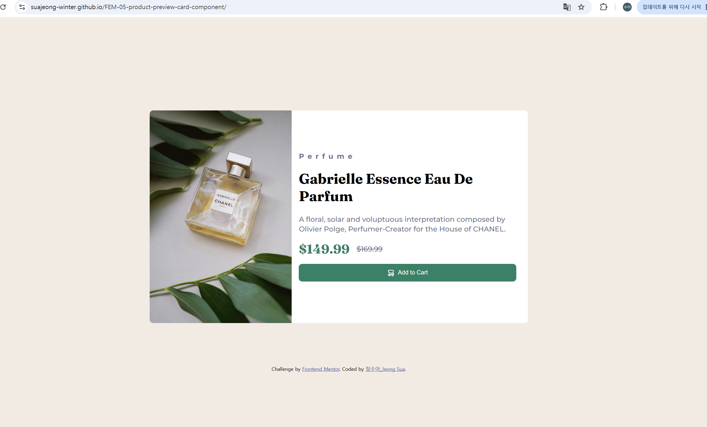
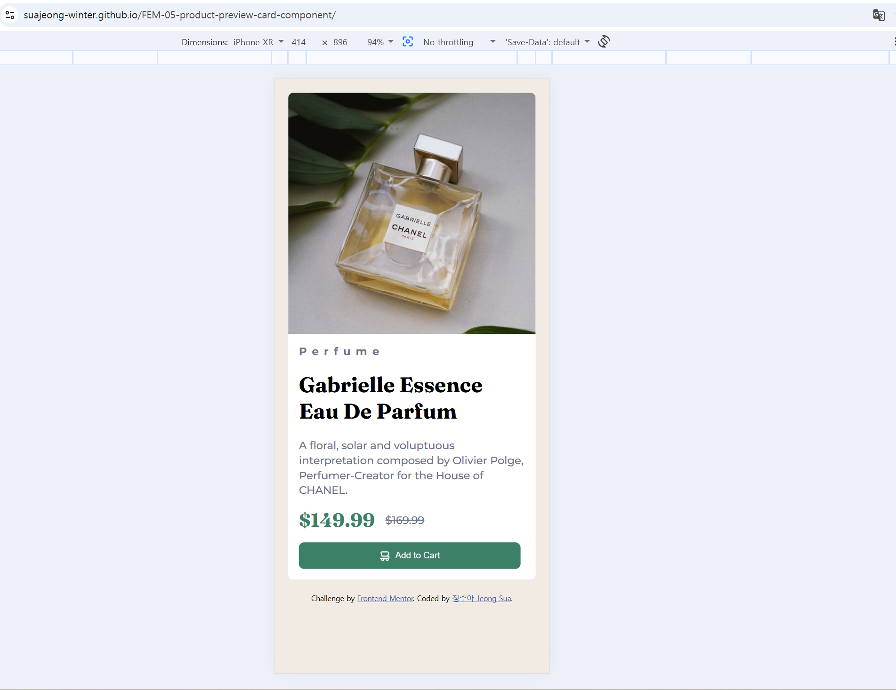
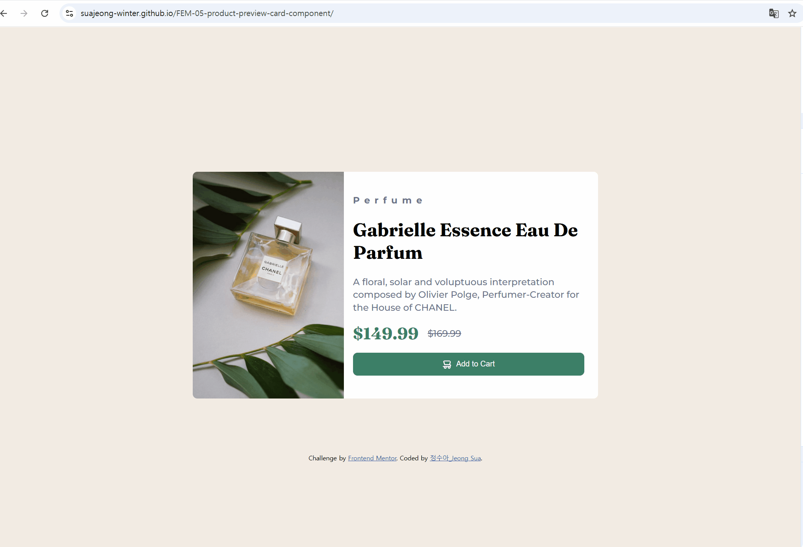

# Frontend Mentor - Product preview card component solution

This is a solution to the [Product preview card component challenge on Frontend Mentor](https://www.frontendmentor.io/challenges/product-preview-card-component-GO7UmttRfa). Frontend Mentor challenges help you improve your coding skills by building realistic projects.

## Table of contents

- [Overview](#overview)
  - [The challenge](#the-challenge)
  - [Screenshot](#screenshot)
  - [Links](#links)
- [My process](#my-process)
  - [Built with](#built-with)
  - [What I learned](#what-i-learned)
  - [Continued development](#continued-development)
  - [Useful resources](#useful-resources)
  - [AI Collaboration](#ai-collaboration)
- [Author](#author)

## Overview

### The challenge

Users should be able to:

- View the optimal layout depending on their device's screen size
- See hover and focus states for interactive elements

### Screenshot

### Links

- Solution URL: [Add solution URL here](https://github.com/SuaJeong-winter/FEM-05-product-preview-card-component/tree/main)
- Live Site URL: [Add live site URL here](https://suajeong-winter.github.io/FEM-05-product-preview-card-component/)

## My process

### Built with

- Semantic HTML5 markup
- CSS custom properties
- Flexbox
- Mobile-first workflow

### What I learned

- I learned html tag <Picture>. 경우에 따라서 다른 이미지가 보이도록 picture 태그를 사용했다.
- I practices media query

### Continued development

- more interactice webapp

### Useful resources

- mdn docs - Almost bible while developing

### AI Collaboration

Describe how you used AI tools (if any) during this project. This helps demonstrate your ability to work effectively with AI assistants.

- What tools did you use (e.g., ChatGPT, Claude, GitHub Copilot)? github copilot, chat GPT
- How did you use them ? debugging, brainstorming solutions
- What worked well? What didn't? It worked well

## Author

- Website - [정수아Jeong Sua](https://github.com/SuaJeong-winter)
- Frontend Mentor - [@SuaJeong-winter](https://www.frontendmentor.io/profile/SuaJeong-winter)
